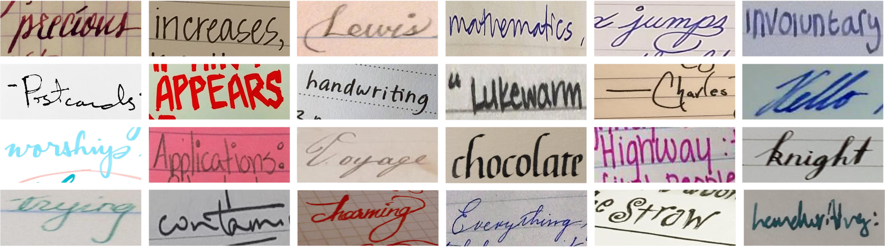

# Fine-Tuning TrOCR for Handwriting Recognition

This project implements a fine-tuning pipeline for Microsoft's TrOCR model using the IMGUR5K handwriting dataset. The system is designed to improve OCR performance on handwritten text recognition tasks.



## Project Overview

This repository contains code for:
1. Downloading and preparing the IMGUR5K handwriting dataset
2. Processing and cropping text regions from images
3. Fine-tuning the TrOCR model on handwritten text
4. Evaluating OCR performance on test data

## Requirements

### Core Dependencies
* Python 3.7+
* PyTorch
* Transformers
* OpenCV (cv2)
* Pillow (PIL)
* pandas
* numpy
* tqdm
* loguru
* click

### Model Dependencies
* `microsoft/trocr-large-handwritten` (downloaded automatically via Hugging Face)


## Installation

1. Clone this repository:
```bash
git clone <repository-url>
cd fine-tuning-ocr
```

2. Install the required packages:
```bash
pip install -r requirements.txt
```

## Project Structure

```
├── OCR_Code.ipynb          # Main notebook for fine-tuning TrOCR
├── prepare_dataset.py      # Script for processing and cropping images
├── download_imgur5k.py     # Script for downloading the IMGUR5K dataset
├── transpose_data.ipynb    # Data preparation utilities
└── dataset_info/          # Dataset annotations and metadata
    ├── imgur5k_data.lst
    ├── imgur5k_hashes.lst
    ├── imgur5k_annotations_*.json
    └── *_index_ids.lst
```

## Usage

### 1. Download the Dataset

The IMGUR5K dataset needs to be downloaded first:

```bash
python download_imgur5k.py --dataset_info_dir dataset_info --output_dir images
```

This script:
- Downloads images from IMGUR URLs
- Verifies image integrity using MD5 hashes
- Creates annotation files for training, validation, and testing

### 2. Prepare the Dataset

Process the downloaded images and create cropped text regions:

```bash
python prepare_dataset.py --annotations-path dataset_info --save_path cropped
```

This creates three directories: `train/`, `val/`, and `test/` with cropped text regions.

### 3. Fine-tune TrOCR

Open and run `OCR_Code.ipynb` in Jupyter Notebook or VS Code:

1. The notebook loads the TrOCR model and processor
2. Prepares the dataset using a custom PyTorch Dataset class
3. Fine-tunes the model on the IMGUR5K dataset
4. Evaluates the model's performance

## Dataset Format

The IMGUR5K dataset annotations are stored in JSON files with the following structure:

```json
{
    "index_id": ["id1", "id2", ...],
    "index_to_annotation_map": {"id1": ["anno1", "anno2"], ...},
    "annotation_id": {
        "anno1": {
            "bounding_box": [xc, yc, w, h, a],
            "text": "example text"
        },
        ...
    }
}
```

Where:
- `bounding_box` format is `[xc, yc, w, h, a]`:
  - `(xc, yc)`: center of the rotated box
  - `(w, h)`: width and height
  - `a`: rotation angle in degrees (counterclockwise)

## Model Architecture

This project uses Microsoft's TrOCR (Transformer-based OCR) model, which combines:
- Vision Transformer (ViT) encoder: Processes the input image
- RoBERTa decoder: Generates text output
- End-to-end training for handwritten text recognition

## Dataset Statistics

| Description | Count |
| :--- | :--- |
| Page Images | 8,177 |
| Word Images | 230,573 |
| Unique Words | 49,317 |

Dataset splits:
- Training: 80% (~6.5K images)
- Validation: 10% (~820 images)
- Testing: 10% (~820 images)

## Performance and Evaluation

The model's performance can be evaluated using the following metrics:
- Character Error Rate (CER)
- Word Error Rate (WER)
- BLEU Score

Use the evaluation cells in `OCR_Code.ipynb` to compute these metrics on the test set.

## Tips for Better Results

1. **Data Augmentation**: The dataset includes image augmentation techniques to improve model robustness:
   - Random rotation
   - Random resizing
   - Contrast adjustment
   
2. **Training Parameters**:
   - Batch size: 8-16 (depending on GPU memory)
   - Learning rate: 5e-5 with linear decay
   - Number of epochs: 10-20

## Limitations and Considerations

- Performance may vary based on handwriting style and image quality
- Model works best with clear, well-lit images
- Processing very large images may require additional memory

## License and Citation

The IMGUR5K dataset is provided under Creative Commons Attribution-NonCommercial 4.0 International Public License.

If you use this project or dataset, please cite:

```bibtex
@misc{krishnan2021textstylebrush,
      title={TextStyleBrush: Transfer of Text Aesthetics from a Single Example}, 
      author={Praveen Krishnan and Rama Kovvuri and Guan Pang and Boris Vassilev and Tal Hassner},
      year={2021},
      eprint={2106.08385},
      archivePrefix={arXiv},
}
```

## Disclaimer

The dataset images are provided via public IMGUR links. Image availability is subject to IMGUR's policies and original uploaders' decisions.
